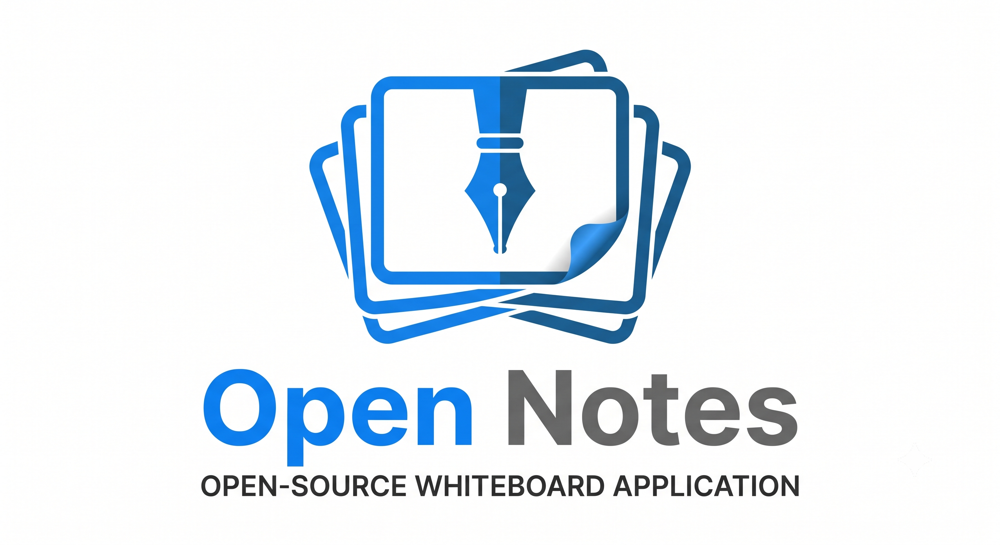

<p align="center">
  
</p>

<p align="center">
  <strong>A high-performance, cross-platform digital whiteboard engine built in modern C++ with an ultra-responsive Android frontend.</strong>
</p>

<p align="center">
  
  
  
  
  
</p>

---

## 💡 The Story & Why Open Notes Exists

Most whiteboard apps on mobile and desktop suffer from the exact same structural flaw: **they tie their core math, rendering, and document state directly to high-level UI frameworks** (such as Java/Kotlin View hierarchies, React Native, or heavy Electron shells). 

The consequence?
- Frequent garbage collection (GC) micro-stutters during pen strokes.
- High touch-to-photon latency (>50ms).
- Sluggish PDF page navigation when loading 50+ slide decks.
- Near-impossible cross-platform portability without rewriting the entire app from scratch.

**Open Notes was designed from day one to break this paradigm.**

We built **a pure, self-contained, platform-agnostic C++ core engine (`libopenwhiteboard`)**. The engine owns 100% of the vector math, Bézier stroke fitting, quad generation, OpenGL ES rendering pipelines, undo/redo command stacks, spatial indexes, and document file I/O.

The UI is purely a thin reactive shell. Whether the frontend is written in **Kotlin (Android)**, **WinUI3/C# (Windows)**, **Qt/GTK (Linux)**, or **WebAssembly (Browser)**, the engine behaves identically with zero-latency, 120 FPS performance everywhere.

---

## 🏛️ Core Architectural Blueprint

The entire system is strictly layered to ensure that the core engine never imports or depends on platform-specific UI frameworks:

```
┌─────────────────────────────────────────────────────────────────────────┐
│                    PLATFORM UI SHELLS (Thin Glass)                      │
│   Android (Kotlin / Jetpack)  •  Windows (WinUI3/C#)  •  Linux (Qt/GTK) │
│       [ Floating Dock | Page Manager | Modals | Touch/Stylus Events ]   │
└────────────────────────────────────┬────────────────────────────────────┘
                                     │
                    JNI / FFI / C-ABI Event Bridge
                    (DirectByteBuffers • 0-Copy Events)
                                     │
┌────────────────────────────────────▼────────────────────────────────────┐
│                  PLATFORM-AGNOSTIC C++ ENGINE CORE                      │
│ ┌──────────────────────┐ ┌──────────────────────┐ ┌───────────────────┐ │
│ │   WhiteboardEngine   │ │    Document Model    │ │   CommandStack    │ │
│ │  (Lifecycle & State) │ │  (Pages/Layers/Objs) │ │    (Undo/Redo)    │ │
│ └──────────┬───────────┘ └──────────┬───────────┘ └─────────┬─────────┘ │
│            │                        │                       │           │
│ ┌──────────▼───────────┐ ┌──────────▼───────────┐ ┌─────────▼─────────┐ │
│ │   Input Dispatcher   │ │    Tools Subsystem   │ │  AutoSaveManager  │ │
│ │ (Kalman/Palm Reject) │ │ (Pen/Eraser/Shapes)  │ │ (Crash Recovery)  │ │
│ └──────────┬───────────┘ └──────────┬───────────┘ └─────────┬─────────┘ │
│            │                        │                       │           │
│ ┌──────────▼────────────────────────▼───────────────────────▼─────────┐ │
│ │                 OpenGL ES 3.0 / Shader Rendering Pipeline           │ │
│ │         (GPU Batching • Centripetal Splines • Texture Caching)       │ │
│ └─────────────────────────────────────────────────────────────────────┘ │
└─────────────────────────────────────────────────────────────────────────┘
```

### Why Any Frontend Can Plug In Seamlessly
1. **Zero Framework Pollution**: The C++ core contains no Android NDK UI wrappers or OS headers. It accepts pure coordinates (`x`, `y`, `pressure`, `tilt`) and outputs draw commands directly to OpenGL / EGL surfaces.
2. **Unified Data Structures**: A single `.obn` document file saved on an Android tablet can be opened instantly in a Windows desktop port with zero conversion.
3. **Deterministic State Machine**: Every tool action (drawing a stroke, moving an object, erasing, or inserting a 3D prism) is encapsulated in an isolated C++ Command pattern with instant undo/redo.

---

## ✨ Features at a Glance

### ⚡ Ultra-Responsive Inking Engine
- **Centripetal Catmull-Rom Spline Fitting**: Eliminates sharp corners, cusps, and self-intersections during rapid handwriting.
- **Dynamic Variable Width**: Pressure, velocity, and tilt mapping for 7 specialized pen instruments (Ballpoint, Calligraphy Brush, Highlighter, Stamp, Laser Pointer, Glitter, and AI Shape Assistant).
- **Predictive Touch Smoothing**: Low-pass Kalman filtering reduces jitter on low-cost digitizers.

### 📄 Background Slide & PDF Streaming (Zero-Lag Deck Loading)
- **Instant Control on Page 1**: When importing a 20+ page PDF or slide deck, Page 1 renders synchronously within milliseconds. The modal dialog immediately dismisses and unlocks full editing capabilities.
- **Background Pipeline**: Pages 2 through N stream asynchronously in a background worker thread.
- **Dynamic Priority Navigation**: If a presenter immediately skips to Slide 15 while background rendering is in progress, the engine automatically deprioritizes earlier pages, prioritizes Slide 15 on-demand, and displays an in-canvas buffering wheel for that specific slide.

### 🎨 Chromatic Color Wheel & Accessibility
- **360° HSV Wheel**: Continuous hue/saturation/value picking with real-time RGB hex input.
- **Irlen Syndrome & Dyslexia Filters**: Built-in 10-preset optical tinting overlays designed specifically for classroom and lecture legibility.

### 📐 2D Primitives & 3D Volumetric Wireframes
- **2D Geometry**: Lines, dual-headed arrows, rectangles, ellipses, triangles, stars, and regular polygons.
- **3D Spatial Primitives**: Real-time axonometric projection for cubes, rectangular cuboids, spheres, cylinders, cones, frustums, pyramids, and triangular prisms.

### 📑 Visual Multi-Page Manager
- Drag-and-drop page reordering, batch selection, duplicate, and deletion.
- Fast-path GPU texture cache allows **0ms instantaneous page switching** without re-decoding bitmap streams.

---

## 📂 Repository Map (For Humans & AI Agents)

```
Open_Note/
├── assets/
│   └── banner.png                     ← Official Open Notes header graphic
├── core/                              ← ⚡ Standalone C++20 Core Engine (`libopenwhiteboard`)
│   ├── CMakeLists.txt                 ← Standalone cross-platform CMake build
│   ├── README.md                      ← Core Engine API & C++ Embedding Guide
│   ├── include/ob/                    ← Public C++ engine header contracts
│   │   ├── WhiteboardEngine.h         ← Primary engine coordinator
│   │   ├── Document.h                 ← Pages, objects, layers model
│   │   ├── Tools.h                    ← Tool hierarchy & drawing state
│   │   ├── CommandStack.h             ← Undo/redo command management
│   │   ├── CanvasCamera.h             ← Viewport transforms & zoom
│   │   ├── InputSystem.h              ← Touch pointers, Kalman, palm rejection
│   │   ├── IRenderPipeline.h          ← Abstract render interface
│   │   ├── RenderPipeline.h           ← GLES 3.0 implementation
│   │   ├── FileFormat.h               ← Native .obn binary delta serialization
│   │   └── AutoSaveManager.h          ← Crash journal & auto-recovery
│   └── src/                           ← Engine C++ implementations
│       ├── engine/                    ← Core lifecycle, document, autosave
│       ├── canvas/                    ← Camera math & viewport culling
│       ├── file/                      ← Compact binary serializer
│       ├── input/                     ← Input gesture & smoothing pipeline
│       ├── rendering/                 ← GLES pipeline, shaders, texture blitting
│       ├── tools/                     ← Pen, eraser, shape math & geometry
│       └── jni/                       ← Ultra-thin JNI event forwarding bridge
├── docs/                              ← Deep-dive technical specifications (35+ files)
│   ├── 00_PROJECT_OVERVIEW.md         ← Architecture rationale, design philosophy
│   ├── 01_REPOSITORY_STRUCTURE.md     ← Build system & modularity guidelines
│   ├── 02_CORE_ENGINE.md              ← C++ engine lifecycle, thread model, memory
│   ├── 03_RENDERING_PIPELINE.md       ← Shaders, GPU batching, quad triangulation
│   ├── 04_CANVAS_SYSTEM.md            ← Coordinate transforms & camera matrix
│   ├── 05_INPUT_SYSTEM.md             ← MotionEvent processing & palm rejection
│   ├── 06_TOOLS/                      ← Pen, eraser, shapes, lasso, text tools
│   ├── 08_UNDO_REDO_SYSTEM.md         ← Command stack & transaction history
│   ├── 09_FILE_FORMAT.md              ← Native .obn binary delta encoding
│   ├── 10_IMPORT_EXPORT/              ← PDFium renderer & vector export
│   └── 16_PERFORMANCE_GUIDE.md        ← Frame timing budgets & ARM core pinning
└── OpenNote/                          ← 📱 Production Android Implementation
    ├── app/src/main/cpp/              ← Android C++ Engine Module (NDK)
    ├── app/src/main/java/             ← Kotlin Reactive UI & JNI Bindings
    │   └── com/cruse/openwhiteboard/
    │       ├── MainActivity.kt        ← Floating docks, flyouts & UI state
    │       ├── ui/                    ← Custom views (WhiteboardSurfaceView, ColorWheel)
    │       └── engine/EngineJNI.kt    ← Kotlin native bridge signatures
    └── app/src/main/res/              ← Vector drawables & UI layouts
```

---

## 🛠️ Building and Running

### System Requirements
| Component | Minimum Version | Recommended |
| :--- | :--- | :--- |
| **Android OS** | API 29 (Android 10) | API 34+ (Android 14 / 15) |
| **Android NDK** | r26c | r27+ |
| **CMake** | 3.22.1 | 3.26+ |
| **JDK** | Java 17 | JDK 21 (Microsoft OpenJDK / Temurin) |

### CLI Quickstart

```bash
# 1. Clone your private repository
git clone https://github.com/YOUR_USERNAME/Open_Note.git
cd Open_Note/OpenNote

# 2. Compile the C++ shared library and assemble debug APK
./gradlew assembleDebug

# 3. Run unit tests
./gradlew testDebugUnitTest

# 4. Install onto your connected Android device or tablet emulator
adb install -r app/build/outputs/apk/debug/app-debug.apk
adb shell am start -n com.cruse.openwhiteboard/.MainActivity
```

<details>
<summary><strong>🔍 Building with Android Studio (Click to Expand)</strong></summary>

1. Open Android Studio (Ladybug / Koala / Meerkat or newer).
2. Select **Open** and choose the `OpenWhiteBoard` directory.
3. Allow Gradle to sync. (The C++ CMake target `openwhiteboard` will configure automatically).
4. Select your target tablet device or emulator and click **Run (Shift + F10)**.
</details>

---

## 🤖 Context Guide for AI Coding Agents & Contributors

If you are an AI assistant (or human developer) exploring or extending this codebase, keep these mental models in mind:

<details>
<summary><strong>🧠 Key Rules for Engine Modification (Click to Expand)</strong></summary>

1. **Keep the C++ Engine Independent**: Never import Android SDK headers (`<android/native_window.h>`, `<jni.h>`) into `include/ob/` or `src/engine/`. Keep platform bridges isolated in `src/jni/` and `src/rendering/`.
2. **Modifying Tools**:
   - To add a new instrument, inherit from `Tool` in `include/ob/Tools.h`.
   - Implement event handling (`onTouchBegan`, `onTouchMoved`, `onTouchEnded`).
   - Emit drawing actions as commands into `CommandStack` so undo/redo works automatically.
3. **Connecting a New Frontend**:
   - Initialize `WhiteboardEngine::create()`.
   - Provide an OpenGL ES context via `IRenderPipeline`.
   - Pass raw touch batches using `InputDispatcher::dispatchTouchEvent()`.
4. **Zero-Alloc Hot Paths**: Avoid dynamic heap allocations inside `onTouchMoved` or `drawFrame`. Use pre-allocated point buffers and arena allocators.
</details>

---

## 🗺️ Roadmap

- [x] **Phase 1: Core Engine & Inking (Completed)**: C++ engine, Bézier spline fitting, GLES pipeline, pressure curves, multi-tool palette.
- [x] **Phase 2: Presentation & Multi-Page (Completed)**: Visual page manager, background PDF/slide streaming queue, 0ms page flipping, Irlen filters.
- [ ] **Phase 3: Cross-Platform Desktop (In Progress)**: WinUI3 / Win32 desktop wrapper with DirectWrite & native pointer APIs.
- [ ] **Phase 4: WebAssembly Shell**: Emscripten compilation targeting WebGL2 for in-browser collaborative whiteboards.

---

## 📜 License

This project is licensed under the **MIT License** — feel free to modify, extend, or build custom frontends.
